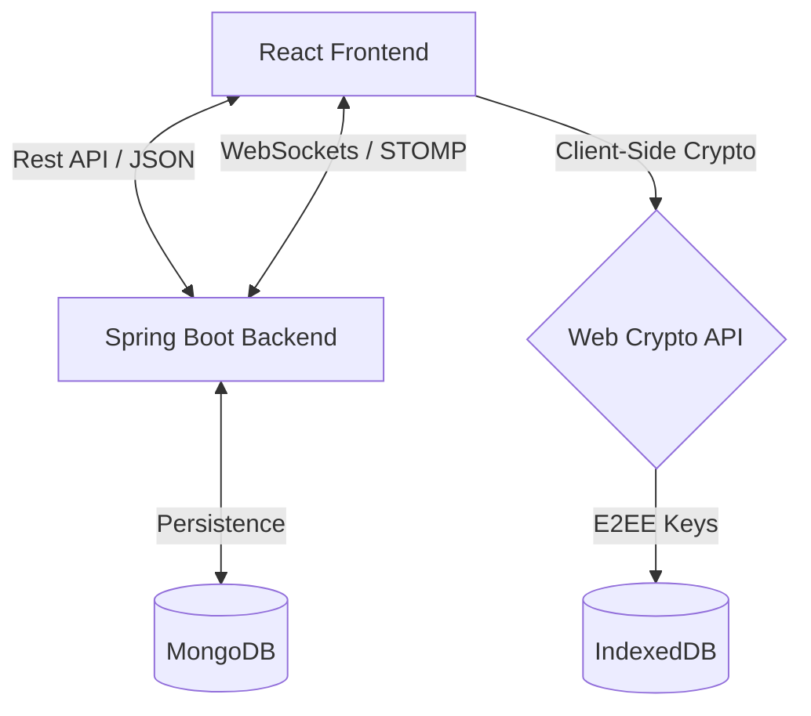

# 🌌 ChatSphere: Complete Project Documentation (Master File)

This is the **full-details document** for the ChatSphere project. It combines all technical, functional, architectural, and setup information into one single reference.

---

## 📋 Table of Contents
1. [🚀 Project Overview](#🚀-project-overview)
2. [🏗️ High-Level Architecture](#🏗️-high-level-architecture)
3. [🔐 End-to-End Encryption (E2EE) Flow](#🔐-end-to-end-encryption-e2ee-flow)
4. [🛠️ Technical Stack Matrix](#🛠️-technical-stack-matrix)
5. [✨ Key Features & Functionality](#✨-key-features--functionality)
6. [🛡️ Recent Stability Hotfixes](#🛡️-recent-stability-hotfixes)
7. [📥 Quick Start Guide](#📥-quick-start-guide)
8. [📊 Feature Completion Status](#📊-feature-completion-status)
9. [🔓 Implementation Walkthrough (Persistence)](#🔓-implementation-walkthrough-persistence)
10. [🔧 Troubleshooting & Common Issues](#🔧-troubleshooting--common-issues)

---

## 🚀 Project Overview
ChatSphere is a state-of-the-art, real-time chat application designed with a focus on **Security**, **Aesthetics**, and **Performance**. It features End-to-End Encryption (E2EE) using RSA-AES, ensuring that messages are only readable by the intended participants.

**Vision:** A secure communication platform where privacy is the default. Every message is encrypted client-side, ensuring that even the server cannot read the content.

---

## 🏗️ High-Level Architecture

---

## 🔐 End-to-End Encryption (E2EE) Flow

| Step | Action | Responsibility |
| :--- | :--- | :--- |
| **1. Key Gen** | RSA Key Pair generated on Signup | `crypto/generateKeys.js` |
| **2. Storage** | Public Key sent to Backend; Private Key saved to IndexedDB | `crypto/keyStorage.js` |
| **3. Session** | AES Key generated for each unique Chat ID | `crypto/aesUtils.js` |
| **4. Encrypt** | Message encrypted with AES Key before sending | `crypto/encryptMessage.js` |
| **5. Decrypt** | Recipient loads AES Key and decrypts payload | `crypto/decryptMessage.js` |

---

## 🛠️ Technical Stack Matrix

- **Frontend**: React (Vite), TailwindCSS, Context API, WebSockets.
- **Backend**: Java (Spring Boot 3.4.1), Spring Security, MongoDB.
- **Database**: MongoDB (Message persistence & User data).
- **Encryption**: AES-256-GCM (Messages), RSA (Key Exchange), BCrypt (Passwords).
- **Animations**: Framer Motion for smooth UI transitions.

---

## ✨ Key Features & Functionality

### 🔐 Security & Authentication
- **JWT-based Auth**: Secure login and signup flow.
- **End-to-End Encryption (E2EE)**: Messages are never seen in plain text by the server.
- **Presence Tracking**: Real-time online/offline status monitoring.

### 💬 Chat & Messaging
- **Direct Messaging**: One-on-one private conversations.
- **Message Persistence**: Complete message history stored in MongoDB, loaded seamlessly upon login.
- **Real-time Updates**: Powered by WebSockets for instant message delivery.
- **Rich UI**: Modern, glassmorphism design with date separators and status indicators.

### 👤 Profile Management
- **Customizable Profiles**: Users can update display name, bio, and avatars.
- **Unique Usernames**: Enforced constraints to ensure identity integrity.
- **User Search**: Real-time user discovery by name or email.

---

## 🛡️ Recent Stability Hotfixes

1. **Infinite Loop Fix**: Optimized presence broadcasting within `ChatWebSocketHandler` to prevent connection hangs.
2. **Log Overflow Prevention**: Implemented size-capped (10MB) and time-rotated (3 days) logging.
3. **Performance Tuning**: Removed blocking synchronous `user.isOnline()` calls during chat initialization.
4. **Database Integrity**: Fixed duplicate key errors on the `name` field using sparse indexing.

---

## 📥 Quick Start Guide

### 1. Backend Setup
1. **Database**: Ensure MongoDB is running on `localhost:27017`.
2. **Compile**: `mvn clean install -DskipTests` inside `chatsphere-backend`.
3. **Run**: `java -jar target/chatsphere-backend-0.0.1-SNAPSHOT.jar`.
*Server runs on port **4040**.*

### 2. Frontend Setup
1. **Dependencies**: `npm install` inside `chatsphere-frontend`.
2. **Environment**: Ensure `.env` points to `http://localhost:4040/api`.
3. **Run**: `npm run dev`.
*Access via `http://localhost:5173` (proxied to 4040).*

---

## 📊 Feature Completion Status

| Feature Category | Status | Completion |
|-----------------|--------|------------|
| Authentication | ✅ Complete | 100% |
| User Management | ✅ Complete | 100% |
| Chat Creation | ✅ Complete | 100% |
| Real-time Messaging | ✅ Complete | 100% |
| **Message Persistence** | ✅ **Complete** | **100%** |
| End-to-End Encryption | ✅ Complete | 100% |
| UI/UX Polish | ✅ Complete | 100% |
| Debugging Tools | ✅ Complete | 100% |

---

## 🔓 Implementation Walkthrough (Persistence)

### How It Works
1. **Sending**: Message is encrypted client-side -> Sent via WebSocket -> Backend saves to MongoDB.
2. **Loading**:
   - User selects a chat (`activeChatId` changes).
   - `useEffect` in `ChatContext` triggers API call to `GET /api/messages/{chatId}`.
   - Encrypted payloads are fetched and then decrypted using the local AES key.
   - Decrypted messages are added to the state, merging with any live messages.

---

## 🔧 Troubleshooting & Common Issues

- **Port 4040 in use**: Ensure no previous backend instance is running.
- **Failed to fetch**: Verify backend is running and CORS is correctly configured for the frontend port.
- **Decryption failed**: This usually occurs if the AES key for a specific chat is missing from the local IndexedDB.
- **Lombok Errors in IDE**: These are cosmetic; the application compiles and runs perfectly via Maven.
